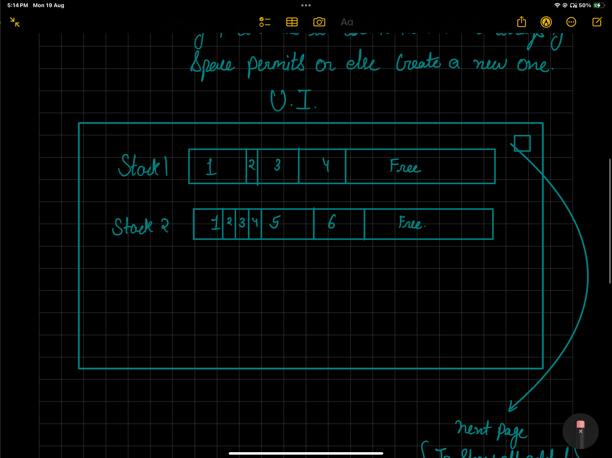

# Bin Packaging Problem

## Introduction

Divide the array into fixed sized array while anyone upload any media/text. compress it through cloudinary & upload it into the fixed size array.

color that array tos show how much filled & how much empty & as new items keeps on coming , continue to add it into those arrays if space permits or else create a new one.

#### Current Problems

- Maintain the state of the stacks such that upon refresh it doesn't become empty
